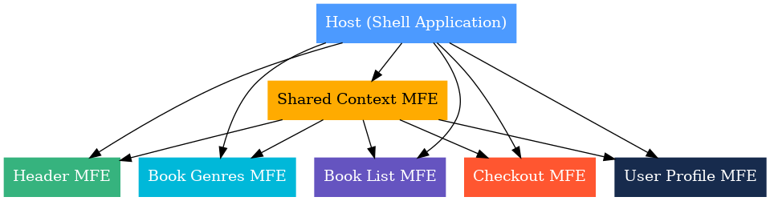

# 📚 MFE Book Store Platform

Working Demo : https://yadav-angad.github.io/mfe-shell-book-store/host/

A modular **Microfrontend architecture** built with **React** and **Webpack Module Federation**, designed for scalability, independent deployments, and seamless integration.

---

## 🏗 Architecture Overview

---

## 🔹 Domain Architecture

### **1. Host (Shell Application)**
- Orchestrates all MFEs, manages routing, shared dependencies, and layout.
- Loads MFEs dynamically.
- Provides global context and authentication.

### **2. Shared Context MFE**
- Centralized state management (Redux/React Context).
- Shares data like cart, user session, and theme.
- Contains shared hooks and utilities.

### **3. Header MFE**
- Displays navigation and branding.
- Shows cart count and user login status.
- Dynamic links for local/prod.

### **4. Book Genres MFE**
- Lists available genres.
- Triggers filtering in Book List MFE via shared state.

### **5. Book List MFE**
- Displays books by genre or search.
- Supports pagination and adding to cart.

### **6. Checkout MFE**
- Displays and manages cart items.
- Handles checkout process.

### **7. User Profile MFE**
- Shows user details and order history.
- Allows profile updates and logout.

---

## ⚙ Key Principles
- **Independence**: Each MFE is built and deployed separately.
- **Loose Coupling**: Communication via shared context, not direct imports.
- **Single Responsibility**: Each MFE focuses on one domain area.
- **Shared Dependencies**: React, React-DOM, and MUI are singletons.
- **Environment Awareness**: Works in both localhost and GitHub Pages.

---

## 🚀 Tech Stack
- React, Redux
- Webpack Module Federation
- Material UI (MUI)
- Babel
- GitHub Pages for deployment
